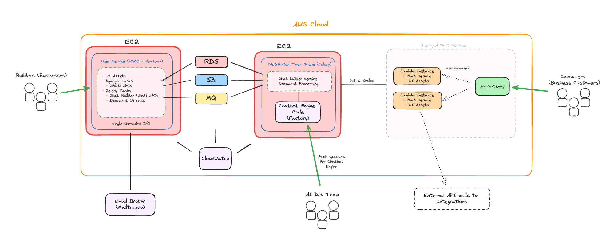

# Chatbot Assistant Builder for Webpages
## This application is currently under development.

**Inspiration**:
Many existing chat agents on websites are limited, preventing users from performing actions like purchasing products or canceling appointments.

**Solution**:
Develop a no-code platform that allows businesses to seamlessly deploy functional chat agents capable of handling user interactions and actions on their websites.

**How**:
Design a chat engine that standardizes conversational flow, while allowing businesses to define specific states and actions, which can be integrated into the chat engine to create tailored experiences for users.

**Technologies:** Python, AWS, Django, Celery, PostgreSQL, S3, RabbitMQ, LangChain, FastAPI, OpenAI, jQuery, LangChain

# Application Setup and Deployment Guide

This guide will help you set up and run the application in development and production environments using Docker and Docker Compose.

## Prerequisites

- Docker
- Docker Compose
- Poetry
- Python 3.x

## Running the Application

Add a .env.dev file to the root directory, using .env.dev.example as an example.

Add a .env.prod file to the root directory, using .env.prod.example as an example.

To run the UI locally in development mode:
docker-compose-f docker-compose.dev.yml up --build

To run the server in production mode:
docker-compose -f docker-compose.prod.yml up --build

# Application Overview

