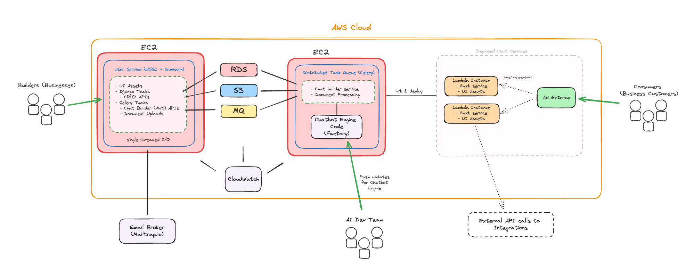

# Chatbot Assistant Builder for Webpages
## This application is currently under development.

**Inspiration**:
Many existing chat agents on websites are limited, preventing users from performing actions like purchasing products or canceling appointments.

**Solution**:
Develop a no-code platform that allows businesses to seamlessly deploy functional chat agents capable of handling user interactions and actions on their websites.

**How**:
Design a chat engine that standardizes conversational flow, while allowing businesses to define specific states and actions, which can be integrated into the chat engine to create tailored experiences for users.

**Technologies:** Python, AWS, Django, Celery, PostgreSQL, S3, RabbitMQ, LangChain, FastAPI, OpenAI, jQuery, LangChain

# Application Setup and Deployment Guide

This guide will help you set up and run the application in development and production environments using Docker and Docker Compose.

## Prerequisites

- Docker
- Docker Compose
- Poetry
- Python 3.x

## Running the Application

Add a .env.dev file to the root directory, using .env.dev.example as an example.

Add a .env.prod file to the root directory, using .env.prod.example as an example.

To run the UI locally in development mode:
docker-compose-f docker-compose.dev.yml up --build

To run the server in production mode:
docker-compose -f docker-compose.prod.yml up --build

# Application Overview



# Getting Started: Poetry
# **Poetry Guide for This Project**

This guide explains how to use **Poetry** to manage dependencies in this project.

---

## **1. Installing Poetry**
If Poetry is not installed, you can install it via:
```bash
curl -sSL https://install.python-poetry.org | python3 -
```
Alternatively, follow the [Poetry installation guide](https://python-poetry.org/docs/#installation).

Verify installation:
```bash
poetry --version
```

---

## **2. Setting Up the Project**

### **Step 1: Activate the Poetry Environment**
To activate the Poetry environment:
```bash
poetry shell
```

To exit the Poetry environment:
```bash
exit
```

### **Step 2: Install Dependencies**
Install all dependencies from `pyproject.toml`:
```bash
poetry install
```
This installs all required packages and sets up the virtual environment.

---

## **3. Adding Dependencies**

### **Add a New Dependency**
To add a new package:
```bash
poetry add <package-name>
```

### **Example:**
To add `python-dotenv`:
```bash
poetry add python-dotenv
```

### **Add Development Dependencies**
For packages needed only for development (e.g., testing, linting):
```bash
poetry add --dev <package-name>
```

### **Example:**
To add `pytest` for testing:
```bash
poetry add --dev pytest
```

---

## **4. Removing Dependencies**
To remove a package:
```bash
poetry remove <package-name>
```

### **Example:**
To remove `python-dotenv`:
```bash
poetry remove python-dotenv
```

---

## **5. Running Commands Inside the Poetry Environment**
If you don’t want to activate the shell, you can run commands directly:
```bash
poetry run python manage.py runserver
```

This ensures the command uses the virtual environment set up by Poetry.

---

## **6. Common Commands Summary**
| **Command**                  | **Description**                          |
|------------------------------|------------------------------------------|
| `poetry shell`                | Activates the Poetry virtual environment.|
| `poetry install`              | Installs dependencies from `pyproject.toml`.|
| `poetry add <package>`        | Adds a new dependency.                   |
| `poetry add --dev <package>`  | Adds a development-only dependency.      |
| `poetry remove <package>`     | Removes a dependency.                    |
| `poetry run <command>`        | Runs a command inside the Poetry environment.|

---

## **7. Project Setup Commands**

### **To Run the Django Server (Development Mode):**
```bash
poetry shell
python manage.py runserver
```

### **To Run Without Activating the Shell:**
```bash
poetry run python manage.py runserver
```

---

This guide helps new users set up and use Poetry effectively for this project. Let me know if you encounter any issues!


# FRONTEND DEVELOPMENT

# **Django + Webpack + React Frontend Development Guide**

## **Overview**
This guide walks you through:
1. Setting up your environment.
2. Running the development servers with Hot Module Reloading (HMR).
3. Building the production bundle for deployment.
4. Understanding the key files and their purposes.

---

## **1. Project Setup Recap**

### **Files Updated:**

- **`webpack.config.js`**: Configures Webpack to bundle your TypeScript/React app and enable hot reloading or cache-busting based on the environment.
- **`settings.py`**: Configured `django-webpack-loader` to dynamically load the correct frontend bundle.
- **`templates/index.html`**: Updated to dynamically include the bundle using ``.

---

## **2. Requirements**

Make sure you have the following installed:
- **Python (Django)**: Version 3.8+ recommended.
- **Node.js**: Version 14+ recommended.
- **npm**: Comes with Node.js.

### **Install dependencies:**
```bash
pip install django-webpack-loader
npm install
```

---

## **3. Running the Application (Development Mode)**

### **Step 1: Start the Django Server**
In one terminal, run:
```bash
python manage.py runserver
```
- This starts Django’s server on `http://localhost:8000/`.

### **Step 2: Start Webpack Dev Server (with Hot Module Reloading)**
In another terminal, run:
```bash
npm run start-dev
```
- This starts the Webpack Dev Server on `http://localhost:3000/` to serve your frontend assets (like `bundle.js`).
- **HMR (Hot Module Reloading)** will update your frontend automatically without refreshing the page.

### **Testing Changes:**
1. Open `http://localhost:8000/` in your browser.
2. Make changes to your **TypeScript/React** components or **CSS**.
3. Your browser should update automatically.

---

## **4. Building for Production (Deployment)**

### **Step 1: Build the Production Bundle**
Run:
```bash
npm run build
```
- This creates an optimized, minified bundle with a cache-busting filename (`bundle.[contenthash].js`).
- The output is placed in `static/js/`.

### **Step 2: Collect Static Files**
Django needs to collect all static files:
```bash
python manage.py collectstatic
```
- This copies the bundled files to `staticdist/` (or wherever `STATIC_ROOT` is set).

### **Step 3: Run Django Server**
Run Django’s server:
```bash
python manage.py runserver
```

---

## **5. Development vs Production Summary**

| **Environment** | **Command**         | **Description**                              |
|-----------------|---------------------|----------------------------------------------|
| Development     | `npm run start-dev`  | Runs Webpack Dev Server with HMR.             |
| Development     | `python manage.py runserver` | Starts Django backend server.        |
| Production      | `npm run build`      | Builds the production bundle.                 |
| Production      | `python manage.py collectstatic` | Collects all static files.         |

---

## **6. Example Commands**

### **Run Development Mode:**
```bash
python manage.py runserver
npm run start-dev
```

### **Build for Production:**
```bash
npm run build
python manage.py collectstatic
python manage.py runserver
```

---

## **7. Key Files and Their Purpose**

### **`webpack.config.js`** (Frontend Build Configuration)
Configures Webpack for development and production:
```javascript
const path = require('path');
const BundleTracker = require('webpack-bundle-tracker');

module.exports = (env, argv) => {
  const isProduction = argv.mode === 'production';
  return {
    entry: './backend/src/index.tsx',
    output: {
      path: path.resolve(__dirname, 'static/js'),
      filename: isProduction ? 'bundle.[contenthash].js' : 'bundle.js',
      publicPath: isProduction ? '/static/js/' : 'http://localhost:3000/static/js/',
    },
    module: {
      rules: [
        {
          test: /\.(js|jsx|ts|tsx)$/,
          exclude: /node_modules/,
          use: 'babel-loader',
        },
        {
          test: /\.css$/,
          use: ['style-loader', 'css-loader'],
        },
      ],
    },
    resolve: {
      extensions: ['.js', '.jsx', '.ts', '.tsx'],
    },
    plugins: [
      new BundleTracker({ filename: './webpack-stats.json' }),
    ],
    mode: argv.mode || 'development',
    devtool: isProduction ? false : 'eval-source-map',
    devServer: {
      port: 3000,
      hot: true,
      headers: { 'Access-Control-Allow-Origin': '*' },
      proxy: {
        '/': 'http://localhost:8000',
      },
    },
  };
};
```

### **`settings.py`** (Django Configuration)
```python
INSTALLED_APPS = [
    # Other apps...
    'webpack_loader',
]

WEBPACK_LOADER = {
    'DEFAULT': {
        'BUNDLE_DIR_NAME': 'js/',  # Subdirectory inside 'static/'
        'STATS_FILE': os.path.join(BASE_DIR, 'webpack-stats.json'),  # Path to the manifest
    }
}
```

### **`package.json`** (NPM Scripts and Dependencies)
```json
{
  "scripts": {
    "build": "webpack --mode production",
    "start-dev": "webpack serve --mode development --open"
  },
  "dependencies": {
    "react": "^18.3.1",
    "react-dom": "^18.3.1",
    "js-yaml": "^4.1.0",
    "lucide-react": "^0.456.0",
    "reactflow": "^11.11.4"
  },
  "devDependencies": {
    "@babel/core": "^7.25.2",
    "@babel/preset-env": "^7.25.4",
    "@babel/preset-react": "^7.24.7",
    "@babel/preset-typescript": "^7.20.0",
    "babel-loader": "^9.2.1",
    "css-loader": "^6.8.1",
    "style-loader": "^3.3.3",
    "webpack": "^5.95.0",
    "webpack-cli": "^5.1.4",
    "webpack-bundle-tracker": "^1.0.0-beta.1"
  }
}
```

### **`index.html`** (Django Template)
```html




Chatbot Builder


<div id="react-root" style="height: 80vh;"></div>



<!-- Automatically load the correct hashed bundle -->


```

---

## **8. Folder Structure Recap**

```plaintext
├── backend/
│   ├── src/                  # Frontend source files (TypeScript/React)
│   │   └── index.tsx         # Main React/TypeScript entry point
│   └── templates/
│       └── index.html        # Django template that includes the React app
├── static/
│   └── js/                   # Location for Webpack bundles (development mode)
├── staticdist/               # Where Django collects static files (for production)
├── webpack.config.js         # Webpack configuration
├── webpack-stats.json        # Generated manifest file for django-webpack-loader
├── manage.py                 # Django management script
└── package.json              # npm scripts and dependencies
```

---

## **9. Additional Notes**

- **Auto-reloading in Django:** Django will automatically reload the server when Python files change.
- **Live updates with Webpack:** HMR (Hot Module Reloading) updates your frontend files without a page refresh.
- **Production Tip:** Use `collectstatic` to gather all assets for deployment.